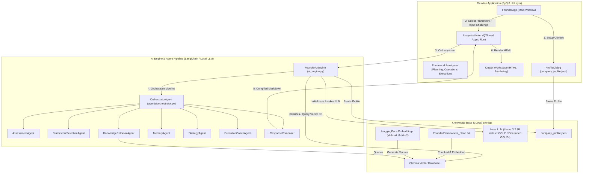

# Founder Frameworks AI Consultant

Founder Frameworks AI Consultant is a local, privacy-first desktop application designed to provide founders with personalized diagnostic assessments, strategy advice, and actionable execution plans based on proprietary business frameworks.

Unlike generic cloud-based chatbots that offer boilerplate MBA responses, Founder AI acts as a dedicated business diagnostic system. It orchestrates a local **multi-agent pipeline** using local large language models (LLM), vector search databases (ChromaDB), and structural validations entirely offline to protect proprietary business metrics.

---

## Key Differentiators & Product Value
* **100% Local & Private:** No external API calls are made during diagnostics. Your business strategy, financial health data, and client metrics remain on your local machine.
* **Context-Grounded Strategy:** Employs RAG (Retrieval-Augmented Generation) against a curated database of 13 proprietary founder frameworks to translate challenges into structured actions.
* **Multi-Agent Diagnostics:** Splits analysis across dedicated cognitive roles (Assessment, Framework Selection, Strategy, and Execution) to yield deeper, more actionable recommendations.
* **Strict Quality Safeguards:** Validates strategy outputs using a deterministic composer contract parser to prevent instruction leaks, format bugs, and cloud fallback dependencies.

---

## Architecture Overview

The system architecture cleanly decouples the user interface, RAG context matching, and the multi-agent pipeline:



### Cognitive Agent Roles
1. **AssessmentAgent:** Extracts startup stage and industry context directly from the company profile, grounding the model in the specific domain.
2. **FrameworkSelectionAgent:** Selects the best proprietary framework to solve the query (with UI manual overrides preserved).
3. **KnowledgeRetrievalAgent:** Queries ChromaDB for the relevant framework definitions and rules.
4. **MemoryAgent:** Recovers short-term conversational context from previous queries in the session.
5. **StrategyAgent:** Applies framework rules to the founder's challenge, translating textbook examples (like clothes or retail) into custom strategy mindsets.
6. **ExecutionCoachAgent:** Formulates a single high-impact priority action and three specific task lists for the team.
7. **ResponseComposer:** Reassembles outputs into the strict 7-part output contract.

---

## Directory Structure
```
├── agents/                  # Cognitive Agent implementations
│   ├── assessment_agent.py  # Stage/Industry grounding agent
│   ├── execution_agent.py   # Task planning coach
│   ├── framework_agent.py   # Automated framework matcher
│   ├── memory_agent.py      # Conversation context retriever
│   ├── orchestrator.py      # Pipeline controller and output validator
│   ├── response_composer.py # Output formatter
│   └── strategy_agent.py    # Framework-grounded diagnostic agent
├── models/                  # Local GGUF models path (ignored in git)
├── scripts/
│   └── run_competition_audit.py # Performance and regression evaluation suite
├── tests/                   # Automated unit and contract integration tests
├── .env.example             # Configuration settings template
├── ai_engine.py             # Core vector database and LLM initializer
├── app.py                   # PyQt6 Graphical Desktop interface
├── Dockerfile               # Containerization build blueprint
└── docker-compose.yml       # Docker environment compose services
```

---

## Production Readiness & DevOps

### 1. Privacy & Security Model
All data processing happens offline. Model inference runs inside a local `llama-cpp-python` session, and embeddings are computed locally via `sentence-transformers`. No external network requests are made, protecting your IP and client metrics.

### 2. Error Handling & Auto-Retry
If an LLM output fails to conform to the strict markdown structural contract, the `OrchestratorAgent` intercepts the output, logs the failure, and triggers a single, low-latency retry. If the retry fails, it falls back to a safe formatted template rather than crashing the UI thread.

### 3. Local Configuration Management
System configurations are externalized into `.env`. Copy the template to configure directories, models, and hyperparameters:
```bash
cp .env.example .env
```
Key configuration parameters:
* `LLM_REPO_ID` / `LLM_FILENAME`: Hugging Face repository and model to load.
* `CHROMA_DB_DIR`: Directory where vector databases are persistent.
* `LLM_TEMPERATURE` / `LLM_MAX_TOKENS`: Hyperparameters governing generation quality.

---

## Setup & Running the Application

### Local Setup
Ensure Python 3.11+ is installed.
1. Install dependencies:
   ```bash
   pip install -r requirements.txt
   ```
2. Place your local GGUF model in the `models/` directory (or let the app automatically download the default Llama 3.2 3B model at launch).
3. Run the desktop app:
   ```bash
   python app.py
   ```

### Docker Containerization (DevOps & CI/CD)
To compile dependencies and execute automated testing without PyQt6 X11 GUI overhead, you can run the test suite and audit script inside Docker:

* **Run unit and contract tests in Docker:**
  ```bash
  docker-compose run --rm test-runner
  ```
* **Run full regression and performance audit in Docker:**
  ```bash
  docker-compose run --rm audit-runner
  ```

---

## Functional Verification & Testing
We include a comprehensive offline test suite of 18 test cases and 5 representative scenario models:
* **Run tests locally:**
  ```bash
  python -m unittest discover -s tests -p "test_*.py"
  ```
* **Run local audit benchmarking:**
  ```bash
  python scripts/run_competition_audit.py
  ```
This generates a detailed `COMPETITION_READINESS_AUDIT.md` report showing initialization latencies, agent execution times, and pipeline validations.
