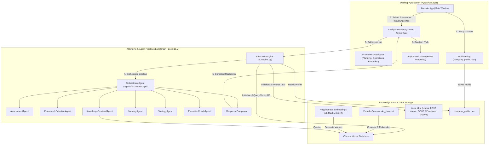

# Founder Frameworks AI Consultant

Founder Frameworks AI Consultant is a local, privacy-first desktop application designed to provide founders with personalized diagnostic assessments, strategy advice, and actionable execution plans based on proprietary business frameworks.

The application has been designed as a **multi-agent pipeline** orchestrating local large language models (LLM), vector search databases (ChromaDB), and structural validations entirely offline.

---

## Architecture Overview

The system architecture decouples user interface execution, RAG context matching, and the agent orchestration sequence:



### Core Components

1. **PyQt6 GUI Application (`app.py`)**:
   * **Framework Navigation**: Persistent left sidebar displaying structured categories (`PLANNING`, `OPERATIONS`, `EXECUTION`) with custom selection cards.
   * **Company Context**: Automatic onboarding profile setup configuration storing details in `company_profile.json`.
   * **Async Threading**: Spawns an `AnalysisWorker` via `QThread` to prevent main window freezing during model inference cycles.
2. **AI Core (`ai_engine.py`)**:
   * Standardizes on the local **Llama 3.2 3B GGUF** model (with priority load for custom fine-tuned weights like `founder-ai-3b-q8.gguf`).
   * Sets up a local persistent **Chroma vector database** containing embedded fragments of the frameworks text (`FounderFrameworks_clean.txt`) using the `all-MiniLM-L6-v2` transformer model.
3. **Multi-Agent Orchestrator (`agents/orchestrator.py`)**:
   * Coordinates the sequence of execution: `AssessmentAgent` ➔ `FrameworkSelectionAgent` ➔ `KnowledgeRetrievalAgent` ➔ `MemoryAgent` ➔ `StrategyAgent` ➔ `ExecutionCoachAgent` ➔ `ResponseComposer`.
   * Evaluates outputs against a deterministic **post-composer validator** to ensure all 7 required markdown segments are present, no prompt instructions or JSON structures leak, and no cloud APIs are referenced.
   * Executes a single controlled retry if structural validation fails.
   * Performs structured logging to `orchestrator.log` and fires safe progression notifications to the user interface.

---

## Setup & Running the Application

Ensure the virtual environment is activated and required models are placed in the `models/` directory.

### Run PyQt6 Desktop Application
```bash
./venv/bin/python app.py
```

### Run Performance & Regression Audit Suite
We run a comprehensive functional verification suite across 18 tests and 5 representative offline scenarios:
```bash
./venv/bin/python scripts/run_competition_audit.py
```
This command Benchmarks initialization times, records agent execution durations, verifies structural compliance, and writes a detailed audit report to `COMPETITION_READINESS_AUDIT.md`.
