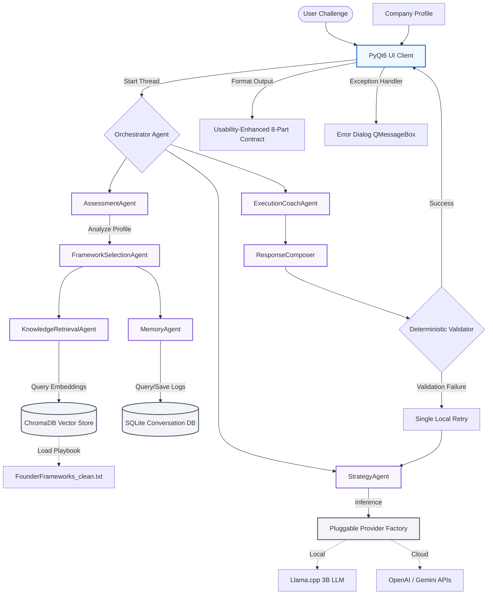

# Founder AI & Founder Frameworks Lab

<p align="center">
  
</p>

Welcome to the official source repository for the **Founder AI Desktop App**, part of the [Founder Frameworks Lab](https://www.founderframeworkslab.com) ecosystem. 

This repository hosts the multi-agent orchestration code, RAG embeddings engine, PyQt6 user interface layout, and local compilation setups.

---

## 🚀 What is Founder Frameworks Lab?
Founder Frameworks Lab is an integrated business operating system consisting of 13 proprietary frameworks that bridge **Strategy, Planning, Operations, and Execution**. It is designed to help founders build scalable business systems, make data-driven decisions, and execute without friction.

The **Founder AI Desktop App** is a private, offline artificial intelligence assistant trained exclusively on this playbook. It acts as an elite operational advisor that lives directly on your computer.

## ✨ Key Features
- **100% Offline & Private:** Your business questions never leave your computer. 
- **Framework-Grounded Answers:** Answers are strictly generated using the 13 Founder Frameworks, avoiding generic AI hallucinations.
- **Cross-Platform:** Native compiled applications for both macOS (Apple Silicon) and Windows.
- **Zero-Setup Execution:** No complex cloud deployments required. Just download, install, and run.

## 🛠️ Technology Stack
The desktop application is built using a modern, high-performance local AI stack:
- **UI Framework:** PyQt6 for native, cross-platform desktop interfaces.
- **AI Core:** Pluggable LLM Provider architecture supporting local offline inference (Llama.cpp) and cloud-based models (OpenAI Chat, Gemini Generative AI).
- **Orchestration:** LangChain for Retrieval-Augmented Generation (RAG) pipelines.
- **Vector Database:** ChromaDB for local semantic search and knowledge retrieval.
- **Build System:** PyInstaller & GitHub Actions for automated cross-platform compilation.

## 🏗️ Architecture Overview
The application utilizes a **multi-agent pipeline** orchestrating local or cloud large language models (LLM) and a RAG search database:



1. **Local RAG Pipeline**: The proprietary `FounderFrameworks_clean.txt` playbook is embedded into a local vector database via ChromaDB.
2. **Multi-Agent Orchestration Sequence**: When a user submits a challenge, a structured pipeline manages the diagnosis:
    - **AssessmentAgent**: Analyzes the startup stage, business model, and primary challenge using the company profile and query context.
    - **FrameworkSelectionAgent**: Selects the single best Founder Framework from the list of 13 proprietary frameworks (or honors manual user selection).
    - **KnowledgeRetrievalAgent**: Dynamically retrieves matching framework segments from ChromaDB.
    - **MemoryAgent**: Integrates conversational session history context.
    - **StrategyAgent**: Formulates core business scenario analysis and Dreamer/Guardian perspective details.
    - **ExecutionCoachAgent**: Generates priority actions and concrete athlete-stage recommendations.
    - **ResponseComposer**: Assembles all components and synthesizes readability layers using the active LLM.
3. **Deterministic Validator & Retry Logic**: Analyzes the generated advice to verify structural integrity and prevent leaks of agent formatting tags, running a single local retry block if any validation failure is detected.
4. **Usability-Enhanced 8-Part Output Contract**: Every output is formatted in a strict 8-part sequence for absolute execution clarity:
    - `Framework Selected` ➔ `Executive Summary` ➔ `Framework Analysis` ➔ `Recommendation` ➔ `Priority Actions` ➔ `Next 24 Hours` ➔ `Risks and Missing Information` ➔ `Suggested Follow-up Questions`.
5. **Absolute Privacy by Default**: Local processing runs completely on-device via Llama.cpp, with options to securely connect to cloud LLMs (OpenAI, Gemini) via user-provided API keys stored in settings.

## 📦 Local Setup Instructions
If you want to run the application from source code:
1. Clone the repository and install requirements:
   ```bash
   pip install -r requirements.txt
   ```
2. Copy the config template to create your `.env` settings:
   ```bash
   cp .env.example .env
   ```
3. Run the PyQt6 desktop app:
   ```bash
   python app.py
   ```

### Running unit and integration tests:
```bash
python -m unittest discover -s tests -p "test_*.py"
```

### Running regression audit:
```bash
python scripts/run_competition_audit.py
```

### Running inside Docker:
* Test runner:
  ```bash
  docker-compose run --rm test-runner
  ```
* Audit runner:
  ```bash
  docker-compose run --rm audit-runner
  ```

### 📦 Looking for Compiled Installers?
If you just want to run the pre-compiled desktop application without setting up Python, navigate to the **[Releases Page on the Release Repository](https://github.com/vivekgreenitive-bit/founder-app-release/releases)** to download the latest macOS and Windows installers.

---

## 🧠 Discover The 13 Frameworks
The AI is powered by our proprietary 13-framework business operating system. 

### 📅 Planning Frameworks
* **[Overall Business Diagnostic (ECG KISS)](https://www.founderframeworkslab.com/frameworks/overall-business-diagnostic-ecg-kiss)**: Define your end goal and simulate solutions.
* **[Yearly Planning Framework (SLR CAMERAS)](https://www.founderframeworkslab.com/frameworks/yearly-planning-framework-slr-cameras)**: Plan yearly milestones and allocate resources.
* **[Quarterly Planning Framework (MC BEERS)](https://www.founderframeworkslab.com/frameworks/quarterly-planning-framework-mc-beers)**: Break down yearly goals into manageable tasks.
* **[Monthly Planning Strategy (PC PEERS)](https://www.founderframeworkslab.com/frameworks/monthly-planning-strategy-pc-peers)**: Maintain momentum month over month.
* **[Weekly Sprint Planning (PS ERP)](https://www.founderframeworkslab.com/frameworks/weekly-sprint-planning-ps-erp)**: Translate monthly goals into actionable sprints.
* **[Daily Standup Protocol (DC ERPRS)](https://www.founderframeworkslab.com/frameworks/daily-standup-planning-dc-erprs)**: Maximize output with daily task management.

### ⚙️ Operations Frameworks
* **[Business System Architecture (OKS REC SME)](https://www.founderframeworkslab.com/frameworks/business-system-architecture-oks-rec-sme)**: Architect robust business systems.
* **[Business Process Mapping (PFA SAAS SME)](https://www.founderframeworkslab.com/frameworks/business-process-mapping-pfa-saas-sme)**: Streamline your processes.
* **[Standard Operating Procedure Design (RSS FEED SME)](https://www.founderframeworkslab.com/frameworks/standard-operating-procedure-design-rss-feed-sme)**: Write, store, and enforce SOPs.

### ⚡ Execution Frameworks
* **[Business Execution Strategy (RPM REAP ER)](https://www.founderframeworkslab.com/frameworks/business-execution-strategy-rpm-reap-er)**: Overcome team inertia and execute plans.
* **[Revenue Generation Framework (RUN DCMS ER)](https://www.founderframeworkslab.com/frameworks/revenue-generation-framework-run-dcms-er)**: Focus entirely on revenue-generating activities.
* **[Performance Evaluation Metrics (ERM FABS ER)](https://www.founderframeworkslab.com/frameworks/performance-evaluation-metrics-erm-fabs-er)**: Evaluate the success of your executions.
* **[Crisis Management Protocol (ADMINS ER)](https://www.founderframeworkslab.com/frameworks/crisis-management-protocol-admins-er)**: Mitigate damage and resolve administrative bottlenecks.

---

### 📚 Get the Book
Want the full breakdown of all 13 frameworks?  
**[Get the Founder Frameworks Book here.](https://www.founderframeworkslab.com/books/founder-frameworks)**

## License
**All Rights Reserved.** 
The proprietary frameworks and the source code are the intellectual property of Vivek Ananth and Founder Frameworks Lab. Redistribution, reverse-engineering, or commercial resale of the binaries is strictly prohibited.
